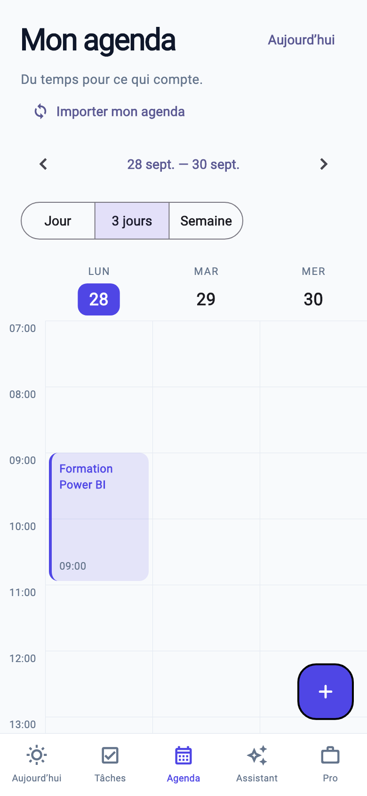

# MyAgenda

**Votre travail. Votre temps. Votre rythme.**

Application **Flutter / Dart**, en français, pour organiser tâches personnelles, missions professionnelles et disponibilités. Identité indigo, turquoise et violet, navigation mobile simple et affichage adapté aux grands écrans.

## Aperçu

  

## Version livrée : 0.1.0 — locale

Le projet suit les trois documents de conception : **valider la V1 visuelle avant de connecter FastAPI**. Il démarre avec un jeu de données de découverte daté du jour du premier lancement. Les modifications sont conservées sur l'appareil. Dans Paramètres, « Effacer les données de découverte » permet de repartir à vide (cela efface aussi vos ajouts : exporter avant).

| Fonction | Disponible |
|---|---|
| Aujourd’hui | Prochaine tâche, mode Focus, compteurs calculés, timeline, créneaux libres, urgences |
| Tâches | Création rapide, modification, suppression confirmée, recherche, filtres, liste et Kanban |
| Détails | Notes privées, projet, client, mission, sous-tâches, progression réelle, priorité, date de début, échéance |
| Kanban | Glisser-déposer entre colonnes sur grand écran ; une colonne par écran mobile avec balayage ; statut modifiable dans le détail |
| Agenda | Jour, 3 jours, semaine ; navigation par date ; déplacement des blocs avec vérification des conflits |
| Planning | Suggestions de créneaux continus, horaires et pauses, échéances, priorité, proposition de journée à valider |
| Focus | Démarrer, pause, reprise, terminer ; un seul chronomètre actif ; état conservé après fermeture |
| Pro | Création/modification de clients et de missions ; tâches associées et avancement calculé |
| Disponibilités | Calculées à partir de toutes les réservations, y compris personnelles ; copie de texte sans détails privés |
| Paramètres | Prénom, jours et horaires, pause, thème sombre, copie d'une sauvegarde JSON |
| Plateformes | Projets iOS, Android et Web inclus |

**Non inclus à ce stade** : compte/authentification, serveur, synchronisation, notifications locales/push, pièces jointes, liens publics avec expiration, calendrier externe, fractionnement automatique, redimensionnement des blocs agenda, récurrence, facturation. L'aperçu client est explicitement local ; aucun faux lien n'est généré. Le texte copié ne se met pas à jour automatiquement.

## Démarrage

Version de référence : **Flutter 3.35.7 / Dart 3.9.2** (voir `.flutter-version`). Installer Flutter depuis [la documentation officielle](https://docs.flutter.dev/install), puis :

```bash
git clone https://github.com/ucef90/MyAgenda.git
cd MyAgenda
flutter pub get
flutter run
```

Pour un essai dans Chrome :

```bash
flutter run -d chrome
```

L'application peut être nommée autrement dans l'interface avec `--dart-define=APP_NAME=Flowtime`. Les noms du lanceur iOS/Android restent définis dans leurs fichiers de plateforme.

## Sur votre iPhone (depuis un Mac)

1. Installer Flutter, Xcode et les outils iOS indiqués dans [la configuration iOS officielle](https://docs.flutter.dev/platform-integration/ios/setup).
2. Exécuter `flutter doctor`, puis corriger les prérequis signalés.
3. Connecter l'iPhone au Mac, accepter la relation de confiance et activer le mode développeur si demandé.
4. Dans le dépôt, exécuter `flutter pub get`, puis `open ios/Runner.xcworkspace`.
5. Dans Xcode, sélectionner **Runner → Signing & Capabilities → Team**, choisir votre équipe Apple et vérifier un identifiant de bundle unique.
6. Sélectionner l'iPhone dans Xcode ou lancer `flutter devices`, puis `flutter run -d <identifiant_iphone>`.

La signature Apple se configure sur votre Mac. Aucun certificat, compte Apple ou profil de provisionnement n'est inclus. La durée et les possibilités d'installation dépendent de votre type de compte Apple. Les tests physiques iPhone et Android restent à réaliser ; les tests locaux de ce dépôt n'équivalent pas à une validation sur appareil.

## Architecture

```text
lib/
  core/          configuration, dates et durées
  models/        Task, ChecklistItem, Client, Mission, Preferences
  repositories/  données de découverte, état Riverpod, sauvegarde locale versionnée
  services/      calcul déterministe des créneaux
  theme/         thèmes clair et sombre
  widgets/       navigation adaptative, cartes et composants communs
  features/
    today/       accueil et timeline
    tasks/       formulaire, détail, liste et Kanban
    calendar/    agenda
    planning/    propositions de planification
    focus/       chronomètre
    pro/         clients, missions et aperçu des disponibilités
    settings/    préférences et sauvegarde
```

`go_router` gère les routes. Riverpod centralise l'état. `SharedPreferences` conserve un document JSON versionné : adapté à cette V1 locale, **sans chiffrement applicatif**. Utiliser le verrouillage de l'appareil et éviter les données sensibles pendant la validation. Le stockage du navigateur peut être supprimé par le navigateur ; copier régulièrement une sauvegarde. L'import de sauvegarde n'est pas encore exposé dans l'interface.

Le statut « En retard » est dérivé de l'échéance et de l'heure courante. Le pourcentage vient de la checklist, pas d'une valeur saisie : 3/7 = 43 %. Une tâche terminée conserve sa réservation pour l'historique et ne devient jamais en retard. Une tâche annulée libère son créneau.

Le moteur utilise l'heure locale de l'appareil, des intervalles semi-ouverts et une pause quotidienne. Les suggestions sont arrondies au prochain pas de cinq minutes, sur 30 jours maximum. La proposition de journée traite les priorités avant les échéances. Un conflit ou une proposition devenue périmée bloque l'application du planning. L'écran d'organisation vise demain après 18h ; un jour non travaillé peut donc n'offrir aucun créneau.

## Vérification

```bash
dart format --output=none --set-exit-if-changed lib test
flutter analyze
flutter test
flutter build web --release
```

Tests : réservations imbriquées, événements traversant minuit, pauses, horaires, échéances, dates minimales, priorités, persistance CRUD, sauvegarde corrompue, chronomètres exclusifs, création de tâche et sous-tâche, focus, navigation mobile et bureau.

La CI GitHub exécute analyse, tests et compilation Web à chaque push/PR. Elle produit une archive de build, **sans publier de site**.

## Suite après validation

1. Valider ergonomie et parcours sur l'iPhone.
2. Construire FastAPI / PostgreSQL / SQLAlchemy / Alembic et l'authentification, avec tests d'isolation des données entre utilisateurs.
3. Remplacer le stockage local par un repository synchronisé, avec migration de cette V1.
4. Ajouter notifications locales, stockage de pièces jointes et permissions natives.
5. Ajouter partage sécurisé, tokens révocables et expirables, filtrage strict des données publiques ; puis portail client.
6. Préparer OVH, Docker Compose, HTTPS et sauvegardes. Aucun déploiement OVH ou App Store n'a été effectué.
