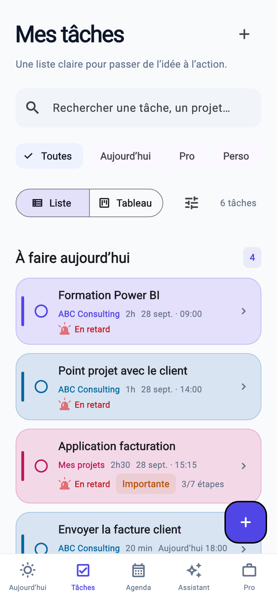
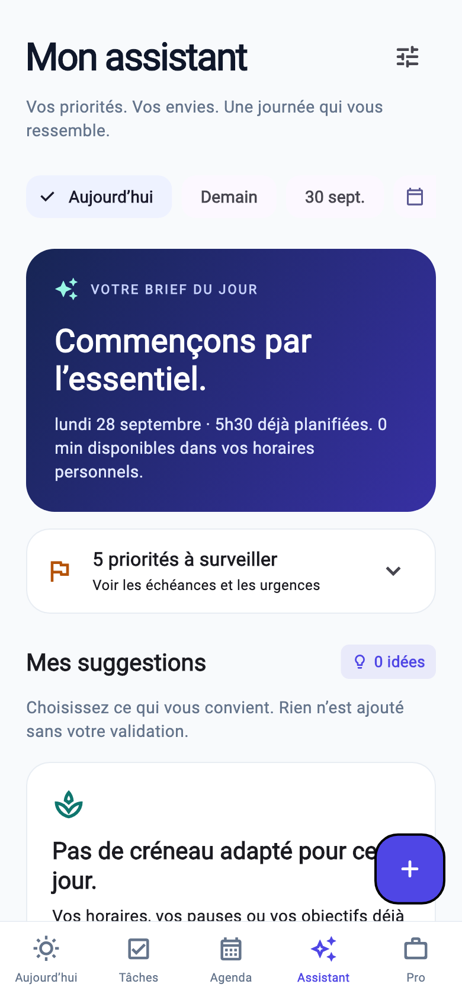

# MyAgenda

**Votre travail. Votre temps. Votre rythme.**

Application **Flutter / Dart**, en français, pour organiser tâches personnelles, missions professionnelles et disponibilités. Identité indigo, turquoise et violet, navigation mobile simple et affichage adapté aux grands écrans.

## Aperçu

  

## Version livrée : 0.4.0 — locale

Le projet suit les trois documents de conception : **valider la V1 visuelle avant de connecter FastAPI**. Il démarre avec un jeu de données de découverte daté du jour du premier lancement. Les modifications sont conservées sur l'appareil. Dans Paramètres, « Effacer les données de découverte » permet de repartir à vide (cela efface aussi vos ajouts : exporter avant).

| Fonction | Disponible |
|---|---|
| Aujourd’hui | Prochaine tâche, mode Focus, compteurs calculés, timeline, créneaux libres, urgences |
| Tâches | Création rapide, modification, suppression confirmée, recherche, filtres, liste et Kanban |
| Détails | Notes privées, projet, client, mission, sous-tâches, progression réelle, priorité, date de début, échéance |
| Kanban | Glisser-déposer entre colonnes sur grand écran ; une colonne par écran mobile avec balayage ; statut modifiable dans le détail |
| Agenda | Jour, 3 jours, semaine ; navigation par date ; déplacement des blocs avec vérification des conflits |
| Planning | Suggestions de créneaux continus, horaires et pauses, échéances, priorité, proposition de journée à valider |
| Focus | Démarrer, pause, reprise, terminer ; un seul chronomètre actif ; état conservé après fermeture |
| Pro | Création/modification de clients et de missions ; tâches associées et avancement calculé |
| Disponibilités | Calculées à partir de toutes les réservations, y compris personnelles ; copie de texte sans détails privés |
| Paramètres | Prénom, jours et horaires, pause, thème sombre, copie d'une sauvegarde JSON |
| Plateformes | Projets iOS, Android, macOS et Web inclus |

**Non inclus à ce stade** : compte/authentification, serveur, synchronisation, notifications sur Mac/Android/Web et push distant, pièces jointes autres que les images et l’audio, liens publics avec expiration, Gmail connecté, fractionnement automatique, redimensionnement des blocs agenda, récurrence, facturation. L'aperçu client est explicitement local ; aucun faux lien n'est généré. Le texte copié ne se met pas à jour automatiquement.

## Nouveautés 0.4.0 — tâches, voix et préparation

- **Cartes entièrement colorées** : catégorie explicite (professionnel, formation, sport, musique, personnel, repos), couleur automatique ou personnalisée. Les anciens titres donnent une catégorie indicative modifiable. Gyrophare doux pour les retards, chronomètre en cours et personnage endormi pour les tâches à venir ; les animations respectent « Réduire les animations ».
- **Avancement du jour** : pourcentage de tâches du jour terminées. Rouge si une tâche du jour est en retard, vert si les fins de créneau prévues sont respectées, bleu si des tâches sont terminées en avance. Le temps écoulé ne vaut pas confirmation de réalisation.
- **Validation visible** : bouton fixé sous le formulaire, au-dessus du clavier, avec attente de la sauvegarde locale.
- **Audio iPhone** : dictée en français (enregistrement puis reconnaissance vocale Apple, à relire avant validation), jusqu’à huit notes audio de trois minutes par tâche, lecture et retrait. Autorisations micro et reconnaissance vocale demandées à l’utilisation. Apple peut traiter la dictée sur ses serveurs ; une note audio conservée seule reste dans le stockage de l’app. Les fichiers M4A et leurs métadonnées sont inclus dans la sauvegarde JSON.
- **Calendrier iPhone** : Agenda → Importer mon agenda. Sélection des calendriers puis aperçu des 90 prochains jours, import sans doublons, reprise des rendez-vous existants en conservant notes, checklist et préparation. Compatible avec les comptes Google déjà ajoutés au Calendrier d’iOS. Les journées entières sont décochées par défaut ; les événements de plus de 24 heures doivent être répartis en tâches journalières. Aucune écriture dans le calendrier source. Les imports peuvent chevaucher des tâches existantes : le planning en tient compte comme engagements fixes.
- À la réouverture, les événements déjà importés sont actualisés ; les nouveaux nécessitent une nouvelle sélection. Les événements supprimés du calendrier ne sont pas supprimés automatiquement de MyAgenda. Un identifiant modifié par le fournisseur peut exiger un rapprochement manuel.
- **Formation** : support préparé, bon de commande signé, mail envoyé — trois états « À vérifier », « À faire », « Oui, confirmé ». Confirmation manuelle, sans inférence à partir d’une absence de preuve. Rappel de préparation 24 h avant, si les rappels sont activés et cette heure est encore à venir.
- **Écran verrouillé** : progression native du temps, prochain rendez-vous, liens « Terminé » et « Pas fini » ouvrant l’application pour enregistrer le statut. Notification de fin de créneau avec actions, en plus des rappels de début. L’activité doit toujours être démarrée depuis l’app ; aucune bascule automatique à une nouvelle activité lorsque l’app est fermée.

**Connexion Gmail / ChatGPT Work non livrée** : la version n’utilise aucun accès mail et ne se présente pas comme connectée. Il faut une application Google OAuth pour iOS (projet, écran de consentement et client correspondant au bundle), des autorisations de lecture Gmail et un stockage sécurisé des jetons avant de construire cette analyse. Les accès des connecteurs ChatGPT ne sont ni extraits ni réutilisés par l’app. Aucun secret n’est inclus dans le dépôt. La page Agenda & connexions explique cet état.

## Nouveautés 0.3.0 — rappels iPhone

- Réglages → Rappels & écran verrouillé : activation volontaire, autorisation iOS, rappel à l’heure de la tâche et en avance (0/5/10/15/30 minutes), bouton de test et accès aux réglages système.
- Rappels locaux natifs, livrés même application fermée. Une tâche sans créneau utilise son échéance ; une tâche sans date ne génère pas de rappel. Suppression des alertes obsolètes après modification, démarrage, suppression ou clôture dans l’application.
- Les 60 alertes futures les plus proches sont programmées ; elles sont renouvelées à l’ouverture. Le résumé programmé et Concentration d’iOS restent prioritaires.
- Activité en direct (iOS 16.2+) sur écran verrouillé et Dynamic Island compatible : tâche en cours, pause, créneau actuel et chronomètre. Touchez la carte pour ouvrir le détail. Une carte retirée manuellement est respectée ; désactivez/réactivez l’option pour la réafficher.
- L’activité démarre pendant que MyAgenda est ouvert (par exemple après avoir touché un rappel ou lancé Focus). Aucun démarrage automatique en arrière-plan ni serveur push. Maximum système : 8 h actives et éventuellement 4 h supplémentaires sur écran verrouillé. La carte ne force pas l’écran à rester allumé. Après l’heure de fin prévue elle indique « Créneau écoulé » ; elle ne marque jamais la tâche comme terminée toute seule.
- Extension WidgetKit `MyAgendaActivityExtension`, pont Swift natif, aucune nouvelle dépendance Flutter. Les préférences et tâches existantes sont conservées.

## Nouveautés 0.2.0

- **Visuels** : import d’images, caméra native iPhone/Android, croquis au doigt ou à la souris, galerie avec zoom, retrait d’un visuel. Les designs doivent être exportés en image (PNG/JPEG) ; pas d’édition de fichiers Figma/PDF. Huit images par tâche, entrées limitées à 20 Mo puis normalisées en PNG à 1 600 px maximum. Les autorisations photos/caméra iOS et fichiers macOS sont déclarées. La caméra n’est pas proposée sur Mac ou Web.
- **Couleurs** : six couleurs au choix et couleur automatique ; même repère dans liste, cartes et agenda, avec filtre par couleur. Les statuts et priorités restent lisibles en texte.
- **Liste** : lignes compactes, validation directe, tri par échéance/priorité/durée/nom, archives à la demande, sections « En cours », aujourd’hui, à venir et sans date.
- **Assistant** : brief par jour, priorités à traiter, suggestions motivées et ajout individuel à l’agenda. Jusqu’à trois tâches puis deux activités personnelles, sans déplacer les rendez-vous.
- **Envies & rythme** : modèles sport, musique, lecture, marche et activités libres ; durée, fréquence hebdomadaire, moment préféré, jours/horaires personnels, marge entre activités et progression hebdomadaire. Les objectifs se configurent dans Assistant → réglages. Ils ne sont pas déduits automatiquement du texte libre.
- **Planning personnel** : créneaux du soir et du week-end, contrôle des conflits, aucune seconde proposition d’une même activité le même jour, respect de l’objectif hebdomadaire. Une marge configurable sépare les suggestions ; une réserve de 30 minutes reste disponible avant d’ajouter une activité.

Le moteur est **local et déterministe** : il analyse les champs structurés de vos tâches et préférences, pas le contenu des images. Il ne fournit ni conversation avec une IA ni programme médical/perte de poids. Aucune requête vers un modèle externe et aucune clé API. La V1.1 est migrée sans effacer ses données.

Les images natives sont copiées dans le dossier Application Support privé de MyAgenda ; les métadonnées restent dans le document JSON. Sur Web, un espace séparé du stockage navigateur est limité à 3,5 Mo de texte encodé pour les images, avec erreur explicite si plein. Un formulaire annulé nettoie ses nouveaux fichiers ; le retrait d’un visuel ne supprime son fichier qu’après sauvegarde réussie des métadonnées. L’export JSON depuis les réglages inclut les images en base64 ; l’import n’est pas encore exposé.

## Démarrage

Version de référence : **Flutter 3.35.7 / Dart 3.9.2** (voir `.flutter-version`). Installer Flutter depuis [la documentation officielle](https://docs.flutter.dev/install), puis :

```bash
git clone https://github.com/ucef90/MyAgenda.git
cd MyAgenda
flutter pub get
flutter run
```

Pour un essai dans Chrome :

```bash
flutter run -d chrome
```

L'application peut être nommée autrement dans l'interface avec `--dart-define=APP_NAME=Flowtime`. Les noms du lanceur iOS/Android restent définis dans leurs fichiers de plateforme.

## Installer sur votre Mac

Préparer Flutter, Xcode (licence acceptée et composants installés) et CocoaPods. Puis, depuis le dépôt :

```bash
bash tool/install_macos.command
```

Le script compile la version native, la place dans `~/Applications/MyAgenda.app` et l'ouvre. Une éventuelle installation précédente est conservée dans le même dossier avec un suffixe de sauvegarde. Le script reconnaît aussi Flutter installé dans `~/Developer/flutter`. Il sélectionne Xcode pour cette commande, sans modifier la configuration système.

Pour développer : `flutter run -d macos`. Les données macOS et iPhone restent séparées dans cette V1 locale.

## Sur votre iPhone (depuis un Mac)

1. Installer Flutter, Xcode et les outils iOS indiqués dans [la configuration iOS officielle](https://docs.flutter.dev/platform-integration/ios/setup).
2. Exécuter `flutter doctor`, puis corriger les prérequis signalés.
3. Connecter l'iPhone au Mac, accepter la relation de confiance et activer le mode développeur si demandé.
4. Dans le dépôt, exécuter `flutter pub get`, puis `open ios/Runner.xcworkspace`.
5. Dans Xcode, sélectionner **Runner → Signing & Capabilities → Team**, choisir votre équipe Apple et vérifier un identifiant de bundle unique.
6. Dans **Signing & Capabilities**, sélectionner la même **Team** pour **Runner** et **MyAgendaActivityExtension** ; laisser la signature automatique.
7. Sélectionner l'iPhone dans Xcode ou lancer `flutter devices`, puis `flutter run --release -d <identifiant_iphone>`.

La signature Apple se configure sur votre Mac. Aucun certificat, compte Apple ou profil de provisionnement n'est inclus. La durée et les possibilités d'installation dépendent de votre type de compte Apple. Les tests physiques iPhone et Android restent à réaliser ; les tests locaux de ce dépôt n'équivalent pas à une validation sur appareil.

## Architecture

```text
lib/
  core/          configuration, dates et durées
  models/        Task, ChecklistItem, Client, Mission, Preferences
  repositories/  données de découverte, état Riverpod, sauvegarde locale versionnée
  services/      calcul déterministe des créneaux
  theme/         thèmes clair et sombre
  widgets/       navigation adaptative, cartes et composants communs
  features/
    today/       accueil et timeline
    tasks/       formulaire, détail, liste et Kanban
    calendar/    agenda
    planning/    propositions de planification
    focus/       chronomètre
    pro/         clients, missions et aperçu des disponibilités
    settings/    préférences et sauvegarde
    assistant/   brief, suggestions et objectifs personnels
    attachments/ photos, galerie et croquis
```

`go_router` gère les routes. Riverpod centralise l'état. `SharedPreferences` conserve un document JSON versionné : adapté à cette V1 locale, **sans chiffrement applicatif**. Utiliser le verrouillage de l'appareil et éviter les données sensibles pendant la validation. Le stockage du navigateur peut être supprimé par le navigateur ; copier régulièrement une sauvegarde. L'import de sauvegarde n'est pas encore exposé dans l'interface.

Le statut « En retard » est dérivé de l’échéance ou de la fin du créneau planifié et de l’heure courante. Le pourcentage vient de la checklist, pas d'une valeur saisie : 3/7 = 43 %. Une tâche terminée conserve sa réservation pour l'historique et ne devient jamais en retard. Une tâche annulée libère son créneau.

Le moteur utilise l'heure locale de l'appareil, des intervalles semi-ouverts et une pause quotidienne. Les suggestions sont arrondies au prochain pas de cinq minutes, sur 30 jours maximum. La proposition de journée traite les priorités avant les échéances. Un conflit ou une proposition devenue périmée bloque l'application du planning. L'écran d'organisation vise demain après 18h ; un jour non travaillé peut donc n'offrir aucun créneau.

## Vérification

```bash
dart format --output=none --set-exit-if-changed lib test
flutter analyze
flutter test
flutter build web --release
```

Tests : réservations imbriquées, événements traversant minuit, pauses, horaires, échéances, dates minimales, priorités, persistance CRUD, sauvegarde corrompue, chronomètres exclusifs, création de tâche et sous-tâche, focus, navigation mobile et bureau.

La CI GitHub exécute analyse, tests et compilation Web à chaque push/PR. Un job Apple compile aussi macOS et iOS sans signature de distribution, et produit une archive macOS. Une compilation iOS sans signature ne permet pas l'installation sur un téléphone : celle-ci exige votre équipe Apple et le provisionnement dans Xcode. Aucun site n'est publié par la CI.

### Correctifs 0.1.1

- Modifier une tâche annulée conserve son statut ; la rouvrir revalide son ancien créneau pour éviter un chevauchement.
- Le mode Focus ne réactive plus une tâche annulée ou terminée depuis un écran resté ouvert.
- Repartir avec un espace vide conserve les horaires, les jours travaillés et le thème choisis.
- Cible native macOS, icône MyAgenda, fenêtre redimensionnable et script d'installation utilisateur.

## Suite après validation

1. Valider ergonomie et parcours sur l'iPhone.
2. Construire FastAPI / PostgreSQL / SQLAlchemy / Alembic et l'authentification, avec tests d'isolation des données entre utilisateurs.
3. Remplacer le stockage local par un repository synchronisé, avec migration de cette V1.
4. Ajouter rappels sur les autres plateformes et synchronisation des images.
5. Ajouter partage sécurisé, tokens révocables et expirables, filtrage strict des données publiques ; puis portail client.
6. Préparer OVH, Docker Compose, HTTPS et sauvegardes. Aucun déploiement OVH ou App Store n'a été effectué.
